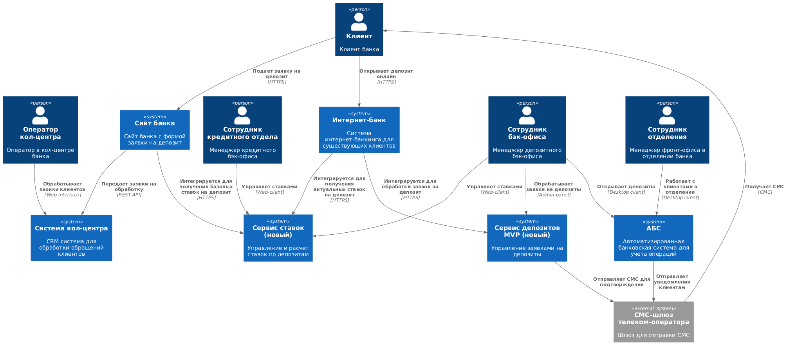
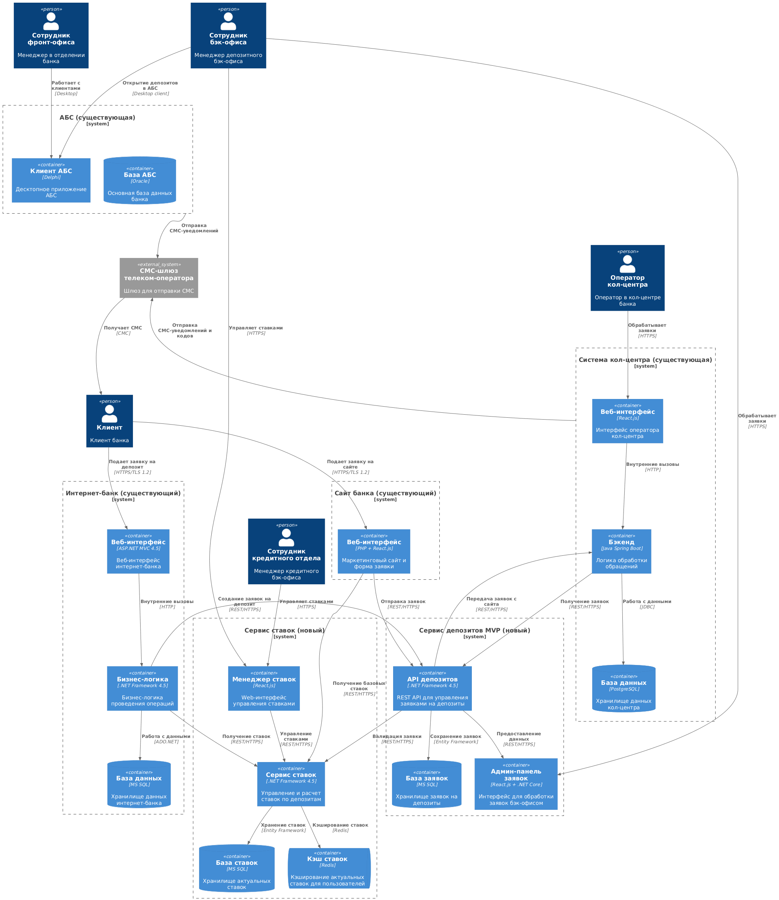

### **Название задачи:** Архитектурное решение для MVP онлайн-открытия депозитов в банке "Стандарт"
### **Автор:** Архитектор команды цифровой трансформации
### **Дата:** 27.10.2025
### **Функциональные требования**
Опишите здесь верхнеуровневые Use Cases. Их нужно оформить в виде таблицы с пошаговым описанием:

| **№** | **Действующие лица или системы**           | **Use Case**                                 | **Описание**                                                                                                                                                                                                                                                                                                                  |
| :---: | :----------------------------------------- | :------------------------------------------- | :---------------------------------------------------------------------------------------------------------------------------------------------------------------------------------------------------------------------------------------------------------------------------------------------------------------------------- |
|   1   | Клиент, Интернет-банк, АБС                 | Подача заявки на депозит через интернет-банк | 1. Клиент аутентифицируется в интернет-банке 2. Система показывает список депозитов с актуальными и персонализированными ставками 3. Клиент выбирает тип депозита, сумму и срок 4. Система запрашивает подтверждение по СМС 5. Клиент вводит код подтверждения 6. Заявка сохраняется и передается на обработку |
|   2   | Клиент, Сайт, Кол-центр                    | Подача заявки на депозит через сайт          | 1. Клиент заходит на сайт банка 2. Видит список доступных депозитов с базовыми ставками 3. Заполняет форму: ФИО, номер телефона, выбранный депозит 4. Система создает заявку и передает в кол-центр 5. Менеджер кол-центра связывается с клиентом для уточнения деталей                                           |
|   3   | Сотрудник бэк-офиса, АБС, Сервис депозитов | Обработка заявки на депозит                  | 1. Сотрудник видит список новых заявок в админ-панели 2. Проверяет данные клиента и выбранные условия 3. Согласовывает специальные ставки при необходимости 4. Открывает депозит в АБС 5. Система отправляет СМС-уведомление клиенту об открытии депозита                                                         |
|   4   | Сотрудники бэк-офиса, Сервис ставок        | Управление ставками по депозитам             | 1. Сотрудники бэк-офиса и кредитного отдела обновляют ставки через отдельный интерфейс 2. Система синхронизирует актуальные ставки с интернет-банком и сайтом 3. Расчет персонализированных ставок для клиентов интернет-банка                                                                                          |
### **Нефункциональные требования**
Опишите здесь нефункциональные требования и архитектурно значимые требования.

| **№** | **Требование**                                                                                                  |
| :---: | :-------------------------------------------------------------------------------------------------------------- |
|   1   | Все сервисы должны работать 24/7 и быть доступны в 99,9% случаев                                                |
|   2   | В случае сбоя необходимо иметь возможность переключиться на резервный ЦОД                                       |
|   3   | Отклик по всем операциям должен занимать миллисекунды                                                           |
|   4   | Возможность горизонтального масштабирования                                                                     |
|   5   | Весь трафик с сайта и интернет-банка необходимо шифровать, например, с помощью TLS                              |
|   6   | Нужно как можно больше использовать технологии, которые уже есть в банке (например, БД MS SQL и Oracle)         |
|   7   | При использовании новых технологий необходимо, чтобы они были совместимы с существующими платформами разработки |
|   8   | Перевести интернет-банк на микросервисную архитектуру                                                           |
### **Решение**
Приведите диаграммы контекста и контейнеров в модели C4. Опишите там основные компоненты и интеграции всех элементов решения.

[Диаграмма контекста в модели C4](./diagrams/Context.puml)

[Диаграмма контейнеров в модели C4](./diagrams/Container.puml)

Также опишите, какой логикой вы руководствовались в ходе принятия решений и выбора технологий. Не забывайте, что необходимо учесть все функциональные и нефункциональные требования.

**Архитектурный подход:**
Создание отдельного сервиса депозитов как промежуточного слоя между интернет-каналами и АБС для минимизации нагрузки на основную банковскую систему.

**Ключевые компоненты:**

1. **Интернет-банк (ASP.NET MVC 4.5)** - модификация существующей системы:
   - Новый UI для выбора депозитов
   - Интеграция с сервисом ставок
   - Поддержка СМС-подтверждения

2. **Сайт (PHP + React.js)** - доработка маркетингового сайта:
   - Форма подачи заявки на депозит
   - API для передачи данных в сервис депозитов

3. **Сервис депозитов (новый, .NET Core)**:
   - Управление заявками на депозиты
   - REST API для интернет-банка и сайта

4. **Сервис ставок (новый, .NET Core)**:
   - Управление, хранение и кеширование ставок
   - REST API для интернет-банка и сайта

5. **API Gateway** - единая точка входа для внешних запросов

**Технологический выбор:**
- .NET Core для новых сервиса (совместимость с экспертизой команды)
- MS SQL для хранения данных заявок и ставок
- Redis для кэширования ставок
- Обеспечение обратной совместимости с существующей инфраструктурой

### **Альтернативы**
Опишите здесь наиболее важные альтернативные решения.

**Альтернатива 1:** Прямая интеграция интернет-банка с АБС
- Плюсы: Быстрая реализация, меньше компонентов
- Минусы: Риск перегрузки АБС, ограничения масштабирования

**Альтернатива 2:** Полная миграция на микросервисную архитектуру
- Плюсы: Лучшая масштабируемость, современный подход
- Минусы: Длительная реализация, высокие риски

**Недостатки, ограничения, риски**

Подробно опишите здесь недостатки, ограничения и риски выбранного решения.

**Недостатки:**
- Сохранение ручной обработки в бэк-офисе на этапе MVP
- Дополнительная сложность из-за промежуточного сервиса
- Необходимость поддержки двух каналов подачи заявок

**Ограничения:**
- Невозможность полной автоматизации из-за требований безопасности
- Зависимость от производительности АБС при финальном открытии депозитов
- Необходимость идентификации новых клиентов в отделении

**Риски:**
- Перегрузка АБС при пиковых нагрузках
- Сложности интеграции с legacy-системами