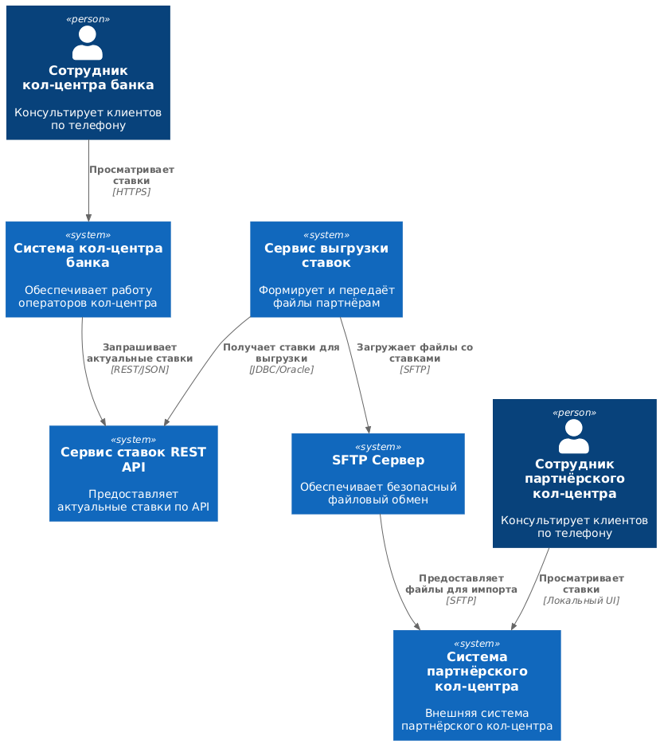
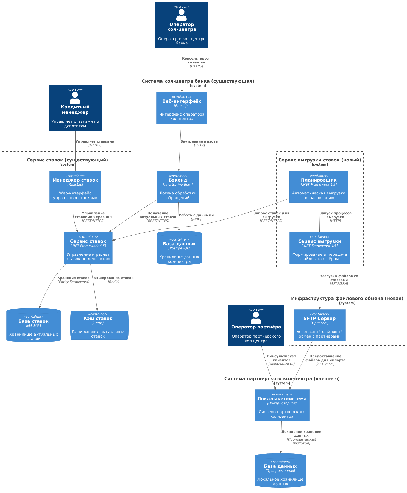
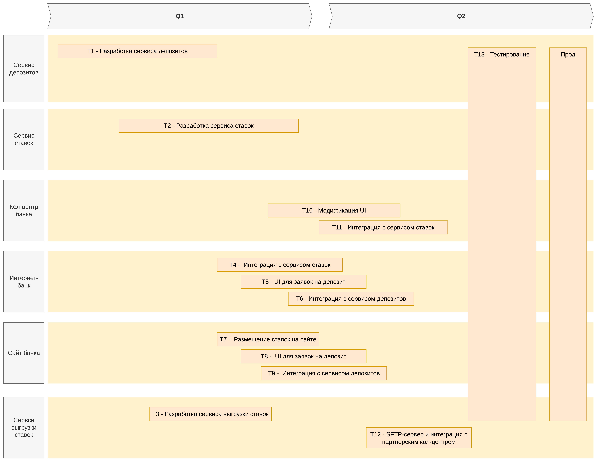

### **Название задачи:** Передача актуальных депозитных ставок в кол-центр банка и партнёрский кол-центр
### **Автор:** Архитектор команды цифровой трансформации
### **Дата:** 27.10.2025
### **Функциональные требования**
Опишите здесь верхнеуровневые Use Cases. Их нужно оформить в виде таблицы с пошаговым описанием:

| **№** | **Действующие лица или системы**                                                 | **Use Case**                             | **Описание**                                                                                                                                                       |
| :---: | :------------------------------------------------------------------------------- | :--------------------------------------- | :----------------------------------------------------------------------------------------------------------------------------------------------------------------- |
|   1   | Сотрудник кол-центра банка, Система кол-центра банка, Сервис управления ставками | Получение актуальных ставок по депозитам | Сотрудник открывает интерфейс кол-центра и видит текущие ставки по всем депозитным продуктам, запрошенные у сервиса управления ставками, для консультации клиентов |
|   2   | Сервис выгрузки ставок, Сервис управления ставками, SFTP-сервер                  | Передача файла со ставками партнёру      | Сервис выгрузки формирует файл с актуальными ставками, запрошенными у сервиса управления ставками, и передаёт его через SFTP в партнёрский кол-центр по расписанию |
|   3   | Сотрудник партнёрского кол-центра, Система партнёрского кол-центра, SFTP-сервер  | Просмотр ставок в системе                | Сотрудник открывает локальную систему и видит импортированные из SFTP-сервера ставки для консультации клиентов                                                     |
### **Нефункциональные требования**
Опишите здесь нефункциональные требования и архитектурно значимые требования.

| **№** | **Требование**                                                                                                  |
| :---: | :-------------------------------------------------------------------------------------------------------------- |
|   1   | Все сервисы должны работать 24/7 и быть доступны в 99,9% случаев                                                |
|   2   | В случае сбоя необходимо иметь возможность переключиться на резервный ЦОД                                       |
|   3   | Возможность горизонтального масштабирования                                                                     |
|   4   | Весь трафик с сайта необходимо шифровать, например, с помощью TLS                                               |
|   5   | Нужно как можно больше использовать технологии, которые уже есть в банке (например, БД MS SQL и Oracle)         |
|   6   | При использовании новых технологий необходимо, чтобы они были совместимы с существующими платформами разработки |
### **Решение**
Приведите диаграммы контекста и контейнеров в модели C4. Опишите там основные компоненты и интеграции всех элементов решения.

[Диаграмма контекста в модели C4](./diagrams/Context.puml)

[Диаграмма контейнеров в модели C4](./diagrams/Container.puml)

Также опишите, какой логикой вы руководствовались в ходе принятия решений и выбора технологий. Не забывайте, что необходимо учесть все функциональные и нефункциональные требования.

**Ключевые компоненты**:
1. **Компонент управления ставками** - хранение и управление данными по ставкам
2. **REST API Сервис ставок** - предоставление актуальных ставок внутренним системам
3. **Сервис выгрузки ставок** - формирование и передача файлов партнёрам
4. **SFTP Сервер** - безопасный обмен файлами с партнёрами
5. **Компонент интеграции в кол-центре** - получение и отображение ставок
6. **Парсер файлов в партнёрском кол-центре** - импорт ставок в локальную систему

**Логика принятия решений**:
- Использование существующей экспертизы по .NET Framework 4.5 для разработки сервиса
- SFTP выбран как один из поддерживаемых партнёром протокол файлового обмена

### **Альтернативы**
Опишите здесь наиболее важные альтернативные решения.
**Альтернатива 1**: Прямая интеграция API с партнёрским кол-центром
- *Преимущества*: Real-time обновление данных
- *Недостатки*: Не поддерживается партнёром, требует изменений в их системе

**Альтернатива 2**: Ручная выгрузка и отправка по email
- *Преимущества*: Простая реализация
- *Недостатки*: Высокий риск человеческих ошибок, задержки в обновлении

**Альтернатива 3**: Использование очереди сообщений (Kafka)
- *Преимущества*: Высокая производительность и надёжность
- *Недостатки*: Сложность интеграции с партнёром, избыточность для текущих потребностей

**Недостатки, ограничения, риски**

Подробно опишите здесь недостатки, ограничения и риски выбранного решения.

**Недостатки выбранного решения**:
- Задержка в обновлении данных у партнёра
- Двойная логика распространения данных (API + файлы)
- Необходимость поддержки двух форматов данных

**Ограничения**:
- Партнёрский кол-центр не поддерживает API-интеграцию
- Текущая версия интернет-банка несовместима с Kafka
- Ограниченные ресурсы команды разработки

**Риски**:
- Риск рассинхронизации данных между каналами распространения
- Риск недоступности SFTP-сервера
- Риск несовместимости формата файлов с системой партнёра
- Риск превышения бюджета из-за необходимости разработки двух каналов интеграции

[RoadMap](./RoadMap_bank_Standart.drawio)

