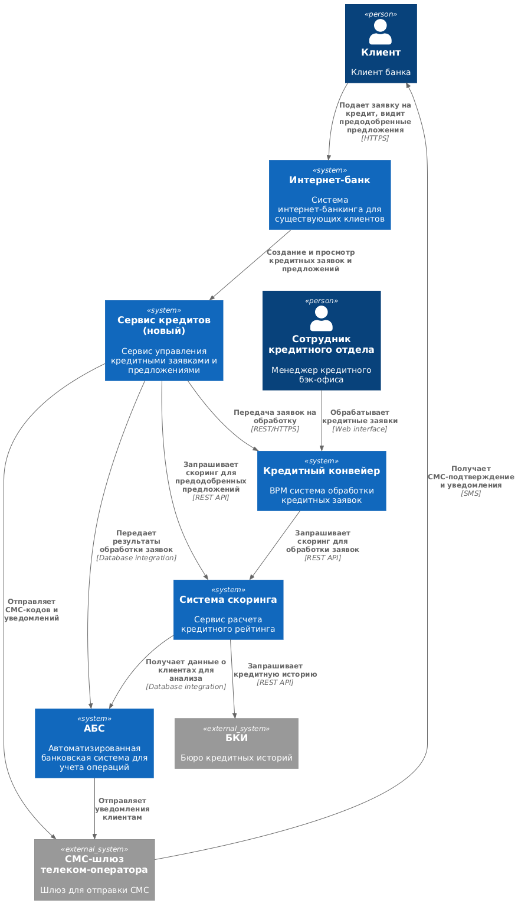
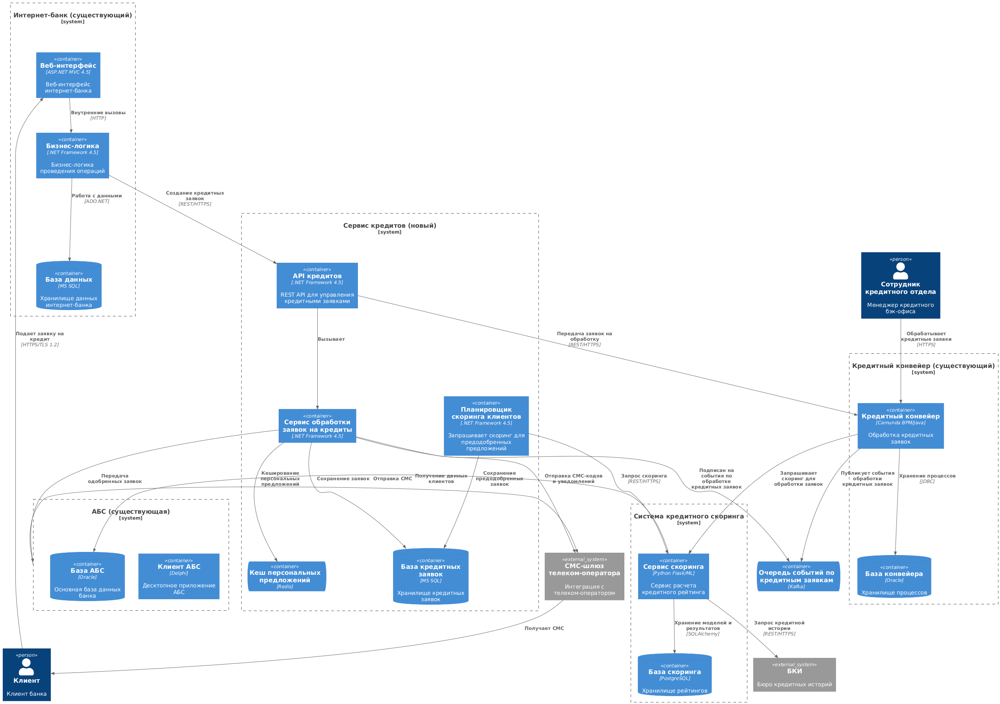

### **Название задачи:** Реализация онлайн-заявки на кредит для банка "Стандарт"
### **Автор:** Архитектор цифровой трансформации
### **Дата:** 27.10.2025
### **Функциональные требования**
Опишите здесь верхнеуровневые Use Cases. Их нужно оформить в виде таблицы с пошаговым описанием:

| **№** | **Действующие лица или системы**            | **Use Case**                                | **Описание**                                                                                                                                                                                                                                                                                                                                                            |
| :---: | :------------------------------------------ | :------------------------------------------ | :---------------------------------------------------------------------------------------------------------------------------------------------------------------------------------------------------------------------------------------------------------------------------------------------------------------------------------------------------------------------- |
|   1   | Клиент, Интернет-банк, Сервис кредитов, АБС | Подача заявки на кредит через интернет-банк | 1. Авторизованный клиент заходит в интернет-банк 2. Видит предодобренные предложения 3. Выбирает кредитный продукт и заполняет заявку 4. Подтверждает операцию СМС-кодом 5. Заявка передается в кредитный конвейер для ускоренной обработки                                                                                                                 |
|   2   | Сервис кредитов, Система скоринга, АБС, БКИ | Предрасчет предодобренных предложений       | 1. Сервис кредитов периодически запрашивает у Системы скоринга анализ данных клиентов из АБС 2. Выполняет скоринг с учетом данных БКИ 3. Сохраняет результаты в кэш сервиса кредитов 4. Обновляет предложения в интернет-банке                                                                                                                                 |
|   3   | Сервис кредитов, Кредитный конвейер         | Синхронизация статусов заявок               | 1. Сервис передает новые заявки в кредитный конвейер 2. Кредитный конвейер обновляет статусы обработки 3. Изменения синхронизируются отправляются через брокер сообщений в сервис кредитов  Сервис кредитов отправляет СМС-сообщение клиенту, а вслучае одобрения кредита дополнительно отправляет заявку в АБС 4. Клиент получает СМС об изменении статуса |
### **Нефункциональные требования**
Опишите здесь нефункциональные требования и архитектурно значимые требования.

| **№** | **Требование**                                                                                                  |
| :---: | :-------------------------------------------------------------------------------------------------------------- |
|   1   | Все сервисы должны работать 24/7 и быть доступны в 99,9% случаев                                                |
|   2   | В случае сбоя необходимо иметь возможность переключиться на резервный ЦОД                                       |
|   3   | Отклик по всем операциям должен занимать миллисекунды                                                           |
|   4   | Возможность горизонтального масштабирования                                                                     |
|   5   | Весь трафик с сайта и интернет-банка необходимо шифровать, например, с помощью TLS                              |
|   6   | Нужно как можно больше использовать технологии, которые уже есть в банке (например, БД MS SQL и Oracle)         |
|   7   | При использовании новых технологий необходимо, чтобы они были совместимы с существующими платформами разработки |
|   8   | Перевести интернет-банк на микросервисную архитектуру                                                           |
### **Решение**
Приведите диаграммы контекста и контейнеров в модели C4. Опишите там основные компоненты и интеграции всех элементов решения. 

[Диаграмма контекста в модели C4](./diagrams/Context.puml)

[Диаграмма контейнеров в модели C4](./diagrams/Container.puml)

Также опишите, какой логикой вы руководствовались в ходе принятия решений и выбора технологий. Не забывайте, что необходимо учесть все функциональные и нефункциональные требования.

**Архитектурное решение:**

Создание нового **Сервиса кредитов** как промежуточного слоя между фронтенд-системами (сайт, интернет-банк) и бэкенд-системами (АБС, кредитный конвейер). 

**Ключевые компоненты:**

1. **Сервис кредитов** - управление жизненным циклом заявок и предложений
2. **Сервис скоринга** - интеграция с БКИ и расчет рейтингов
3. **Кэш предодобренных предложений** - хранение расчетных данных

**Технологический выбор:**
- **.NET Framework 4.5** для новых сервисов (совместимость с существующей экспертизой)
- **REST API** для интеграций (стандартный подход)
- **Oracle** для хранения заявок (совместимость с АБС)
- **Redis** для кэширования предодобренных предложений
- **Kafka** для асинхронной обработки заявок

**Логика принятия решений:**
- Избегание прямой интеграции с АБС для защиты от перегрузки
- Использование существующих технологических стеков для снижения затрат
- Горизонтальное масштабирование критичных компонентов
- Разделение ответственности между сервисами
- Асинхронная обработка для повышения производительности

### **Альтернативы**
Опишите здесь наиболее важные альтернативные решения.

**Альтернатива 1: Прямая интеграция фронтенда с АБС**
- Преимущества: Быстрая реализация, минимальное количество компонентов
- Недостатки: Риск перегрузки АБС, ограниченная функциональность, сложность масштабирования

**Альтернатива 2: Полная замена кредитной системы**
- Преимущества: Современная архитектура, полный контроль над функциональностью
- Недостатки: Высокая стоимость, длительные сроки, риск нарушения текущих процессов

**Альтернатива 3: Использование внешней кредитной платформы**
- Преимущества: Быстрый запуск, снижение затрат на разработку
- Недостатки: Зависимость от вендора, проблемы с интеграцией, ограничения кастомизации

**Недостатки, ограничения, риски**

Подробно опишите здесь недостатки, ограничения и риски выбранного решения.

**Недостатки выбранного решения:**
- Усложнение архитектуры за счет дополнительных сервисов
- Необходимость синхронизации данных между системами
- Задержки в обновлении информации из-за кэширования
- Дополнительные затраты на поддержку новых компонентов

**Ограничения:**
- Существующая версия интернет-банка не поддерживает микросервисы напрямую
- АБС может масштабироваться только вертикально
- Пакетная обработка в кредитном конвейере (раз в сутки)
- Ограниченная пропускная способность интеграции с БКИ

**Риски:**
- Перегрузка системы скоринга при массовой подаче заявок
- Несвоевременное обновление предодобренных предложений
- Проблемы с синхронизацией данных между системами
- Недостаточная производительность при пиковых нагрузках